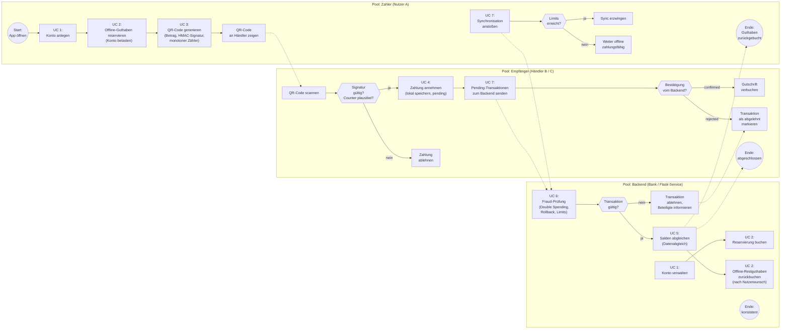

# Flugmodus – Spezifikation: Big-Picture-BPMN

## Frage

Wie lässt sich die Offline-Payment-Anwendung „Flugmodus" (QR-Code-basiert, Web-App, Flask-Backend) in einem Big-Picture-Geschäftsprozessdiagramm (BPMN-Stil, in Markdown einbettbar) auf hoher Ebene darstellen, inklusive aller Anwendungsfälle des Happy Path?

## Executive Summary

1. Mermaid hat keine native BPMN-Unterstützung; der etablierte Weg in Markdown ist ein `flowchart` mit Subgraphen als Pools bzw. Lanes, ergänzt um BPMN-typische Symbolik in den Labels (z. B. `(( ))` für Ereignisse, `{ }` für Gateways). Das ist für ein Big Picture völlig ausreichend.
2. Das Prozessmodell umfasst drei Pools: Zahler (Nutzer A), Empfänger (Händler B/C) und Backend (Bank). Die Kern-Wertschöpfung liegt in der Trennung von Online-Phasen (Kontoführung, Reservierung) und Offline-Phasen (QR-Zahlung, lokale Speicherung).
3. Das von euch entschiedene Reservierungsmodell – Offline-Guthaben wird vorab vom Konto abgebucht – vereinfacht das Backend: Die Synchronisation ist ein Datenabgleich, kein Kreditierungsprozess. Das senkt das Fraud-Risiko strukturell (maximaler Schaden = reserviertes Offline-Guthaben).
4. Die Fraud-Kontrollen (Double Spending, Rollback) sind als eigene Backend-Lane modelliert, damit sie in der Spezifikation als eigenständige Anwendungsfälle mit eigenen Anforderungen dokumentiert werden können.
5. Zwei Typen von Grenzfällen müssen prozessual getrennt bleiben: Sync-Konflikt (zwei Händler synchronisieren konfligierende Transaktionen) und Sync-Fehler (Limitüberschreitung offline, ungültige Signatur).

## Methodik

- Recherche zu BPMN-Darstellungsoptionen in textbasierten, Markdown-kompatiblen Formaten (Mermaid, PlantUML, bpmn.io, Kroki).
- Modellierung des Happy Path anhand der bisherigen fachlichen Festlegungen: Reservierungsmodell für Offline-Guthaben, HMAC-Signatur, monotone Zähler, Limits (20 Transaktionen / 500 Credits / 24 h), Synchronisation als Datenabgleich, Verlustverteilung beim Zahler.
- Darstellungsweise: Mermaid `flowchart LR` mit Subgraphen als BPMN-Pools, BPMN-Symbolik über Node-Shapes (Kreis = Ereignis, Raute = Gateway), Nachrichtflüsse als gestrichelte Kanten (`-.->`).
- Limitation: Kein vollständig normkonformes BPMN 2.0 (keine Pools mit entfernten Kanten, keine kompensierenden Ereignisse). Die Semantik wird über die Labels vermittelt; bei Bedarf kann das Modell später in ein echtes BPMN-Tool (Camunda, bpmn.io) überführt werden.

## Findings

### 1. Werkzeugwahl: BPMN in Markdown

Mermaid bietet keinen nativen BPMN-Diagrammtyp; die Community arbeitet an einem Plugin („bpmn-beta"), das noch nicht im Kern enthalten ist. Für Markdown-first-Dokumentation ist daher ein Mermaid-Flowchart mit Subgraph-basierten Lanes der pragmatische Standard. Alternativen: PlantUML (breitere Prozess-Notation, aber kein natives Markdown-Rendering) und bpmn.io mit Kroki (echtes BPMN, aber XML-basiert und nicht gut im Pull-Request-diffbar). Für eure Spezifikation im Repo ist Mermaid die richtige Wahl.

### 2. Big-Picture-Diagramm

Lesart: Durchgezogene Kanten innerhalb eines Pools sind Sequenzflüsse, gestrichelte Kanten zwischen Pools sind Nachrichtflüsse. Ereignisse (Start/Ende) sind Kreise, Gateways sind Rauten, Anwendungsfälle sind abgerundete Knoten mit „UC"-Nummern.

### 3. Anwendungsfälle (Hoch Ebene)

| UC  | Name                                        | Pool                       | Online/Offline | Kurzfassung                                                                                                                                |
| --- | ------------------------------------------- | -------------------------- | -------------- | ------------------------------------------------------------------------------------------------------------------------------------------ |
| 1   | Konto anlegen                               | Zahler, Backend            | Online         | Registrierung, Wallet-ID und Secret-Key-Ausgabe (HMAC), Initialzähler = 0.                                                                 |
| 2   | Offline-Guthaben reservieren / zurückbuchen | Zahler, Backend            | Online         | Vorab-Abbuchung vom Konto ins Offline-Wallet; Restguthaben bei Sync zurückbuchen (Reservierungsmodell).                                    |
| 3   | QR-Code generieren (Zahlung senden)         | Zahler                     | Offline        | Betrag, Empfänger, Timestamp, Nonce, monotoner Zähler, HMAC-Signatur; lokale Balance sofort reduzieren.                                    |
| 4   | Zahlung annehmen (Geld empfangen)           | Empfänger                  | Offline        | QR-Code scannen, Signatur und Zähler lokal prüfen, Transaktion als `pending` speichern.                                                    |
| 5   | Salden abgleichen                           | Backend                    | Online (Sync)  | Bestätigte Transaktionen buchen; kein Kreditierungsprozess, da Guthaben vorab reserviert ist.                                              |
| 6   | Fraud-Prüfung                               | Backend                    | Online (Sync)  | Prüfung auf Double Spending (transaktions-ID, Zähler), Rollback (Version, previous\_hash), Limits (20 Transaktionen / 500 Credits / 24 h). |
| 7   | Synchronisation                             | Zahler, Empfänger, Backend | Online         | Upload aller `pending`-Transaktionen; Download der Bestätigungen; Rückbuchung des Offline-Restguthabens nach Wunsch.                       |

### 4. Prozessliche Absicherung (im Diagramm verankert)

- Vorab-Reservierung (UC 2) begrenzt den maximalen Schaden eines Double-Spending-Angriffs strukturell auf das Offline-Wallet.
- Lokale Prüfung im Gateway des Empfängers (Signatur, Zähler) fängt triviale Fälschungen offline ab; die verbindliche Prüfung liegt im Backend (UC 6).
- Sync-Erzwingung bei Limit-Erreichung (Gateway „Limits erreicht?") schließt das Offline-Fenster zeitlich und wertmäßig.
- Verlustverteilung: Bei nachgewiesenem Double Spending trägt der Zahler; bei technischem Fehler das Backend. Beide Fälle laufen über das Gateway „Transaktion gültig?" und die Ablehnung mit Benachrichtigung.

## Quellenhinweise

| Quelle                                                                                                       | Glaubwürdigkeit | Zuletzt aktualisiert |
| ------------------------------------------------------------------------------------------------------------ | --------------- | -------------------- |
| [GitHub – Mermaid Issue #7699: Native BPMN 2.0 Support](https://github.com/mermaid-js/mermaid/issues/7699)   | 5/5             | -                    |
| [BPMN for Mermaid – bpmn-beta Plugin-Projekt](https://okhp3.github.io/mermaid-diagram-bpmn/)                 | 3/5             | -                    |
| [Mermaid – Swimlanes Diagram Syntax](https://mermaid.ai/open-source/syntax/swimlanes.html)                   | 4/5             | -                    |
| [Kroki – Diagramme aus Textbeschreibungen (u. a. BPMN, Mermaid)](https://github.com/yuzutech/kroki)          | 4/5             | -                    |
| [Capable Docs – Add diagrams to Markdown](https://help.gocapable.com/markdown/add-diagrams-to-markdown.html) | 3/5             | -                    |

Anmerkung: bpmn-beta ist ein Community-Prototyp und noch nicht Teil des Mermaid-Kerns; die Modellierung hier nutzt bewusst den stabilen `flowchart`-Dialekt. Alle übrigen Festlegungen (Reservierungsmodell, Limits, HMAC, Verlustverteilung) stammen aus euren fachlichen Entscheidungen in diesem Projekt und wurden nicht extern verifiziert.

## Offene Fragen

- Soll UC 2 (Reservierung) auch offline möglich sein (z. B. Reservierung verfallen lassen) oder strikt online? Empfehlung: strikt online, da sonst das Reservierungsmodell unterlaufen wird.
- Wie werden zwei gegenläufige Syncs behandelt, wenn Händler B und C fast gleichzeitig synchronisieren (Reihenfolge-Definition: „erste synchronisierte Transaktion gewinnt")? Das sollte als nicht-deterministisch dokumentiert und im Backend serialisiert werden.
- Erfolgt die Sync-Erzwingung (Gateway „Limits erreicht?") client-seitig (manipulierbar) oder nur serverseitig bei der nächsten Synchronisation? Für den Prototyp reicht client-seitig mit serverseitiger Nachprüfung.
- Sollen Empfänger ebenfalls ein Offline-Wallet haben (Weitergabe erhaltener Credits offline), oder bucht das Backend Empfängerguthaben verbindlich gut? Empfehlung für den Happy Path: verbindliche Gutschrift nur nach Sync.

## Empfehlungen / Nächste Schritte

1. Das Diagramm und die UC-Tabelle in das Repo (z. B. `docs/SPECIFICATION.md`) übernehmen; die Mermaid-Syntax rendert direkt auf GitHub.
2. Jeden UC als eigene, kurze Anforderungskarte ausformulieren (Vorbedingung, Nachbedingung, Fehlerfälle) – UC 3 und UC 6 zuerst, da dort die Fraud-Kontrollen sitzen.
3. Die beiden bereits erstellten Sequenzdiagramme (Double Spending, Rollback mit Händler B und C) als Detaildiagramme unter UC 6 referenzieren.
4. Nach dem Hackathon optional: Überführung in echtes BPMN 2.0 (bpmn.io/Camunda) via Kroki, falls die Kundenkommunikation eine normkonforme Notation verlangt.